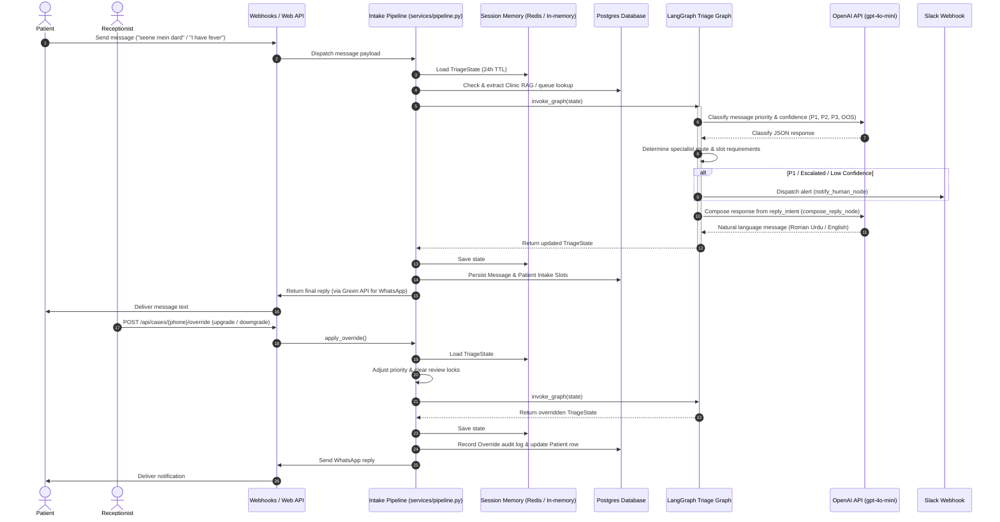
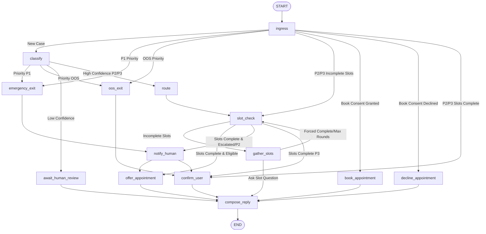

# Sehat Backend Architecture Overview

Sehat is an **agentic clinical intake triage system** built to capture, classify, and route patient health concerns. It orchestrates a multi-channel patient intake loop (via WhatsApp/Green API and Web Chat) powered by a compiled [LangGraph](https://github.com/langchain-ai/langgraph) state machine. Under the hood, it utilizes FastAPI, PostgreSQL (Neon) for persistence, Redis for session memory (with circuit-breaker fallbacks), and OpenAI models for classification, structured slot-filling, and reply composition.

---

## 1. System Context & Flow

The system manages concurrent conversations across multiple channels. Incoming messages trigger execution of the triage pipeline, which queries internal RAG knowledge bases, invokes the LangGraph state machine, books appointments, alerts clinic staff via Slack, and replies back to the patient.



---

## 2. Directory Layout & Module Responsibilities

The Sehat backend is modularized to separate API routing, agent state machine execution, database schema definitions, and peripheral services:

```
backend/
├── app/
│   ├── agent/                 # LangGraph State Machine & Agent Components
│   │   ├── specialists/       # Intake profiles & slot rules for specialties
│   │   │   ├── cardiology.py  # Cardiac intake configuration (P1 overrides, chest pain slots)
│   │   │   ├── general.py     # Default intake slots (chief complaint, duration)
│   │   │   ├── pediatrics.py  # Pediatric intake slots (child age, weight, fever duration)
│   │   │   ├── registry.py    # Specialist profile retrieval
│   │   │   └── router.py      # Keyword-based specialist routing rules
│   │   ├── composer.py        # LLM-powered natural reply generation from clinical intent
│   │   ├── graph.py           # LangGraph StateGraph structure and conditional edges
│   │   ├── nodes.py           # Individual state graph node execution functions
│   │   ├── prompts.py         # System prompts for OpenAI triage and reply composer
│   │   ├── state.py           # TriageState TypedDict schema & state helpers
│   │   └── triage.py          # OpenAI structural triage classifier client
│   │
│   ├── api/                   # FastAPI Endpoints & Controllers
│   │   ├── dashboard.py       # Clinic dashboard query endpoints & developer cleanups
│   │   ├── health.py          # Application health check status
│   │   ├── human_override.py  # Receptionist priority overrides controller
│   │   ├── web_chat.py        # REST API for the inline web patient chat channel
│   │   └── whatsapp.py        # Green API WhatsApp webhook receiver & validator
│   │
│   ├── database/              # SQLAlchemy Database Setup
│   │   ├── base.py            # Base declarative model definition
│   │   └── session.py         # Engine management & FastAPI dependency session injection
│   │
│   ├── models/                # SQLAlchemy Core Database Models
│   │   ├── appointment.py     # 15-minute slot doctor bookings
│   │   ├── case.py            # (Reserved for dashboard-specific case tracking)
│   │   ├── clinic_chunk.py    # RAG clinic FAQ knowledge schema (pgvector)
│   │   ├── message.py         # Inbound/outbound patient messages history
│   │   ├── override.py        # Receptionist override decisions audit trail
│   │   └── patient.py         # Patient metadata and persistent intake slot caches
│   │
│   ├── services/              # Core Domain Business Logic Services
│   │   ├── clinic_info.py     # FAQ and queue query matching
│   │   ├── dashboard.py       # Aggregates active sessions with database history
│   │   ├── intake.py          # Webhook facade routing to the intake pipeline
│   │   ├── memory.py          # Redis memory cache for WhatsApp chats (24h TTL)
│   │   ├── override.py        # Receptionist override database actions
│   │   ├── persist.py         # Database write operations for messages and patients
│   │   ├── pipeline.py        # Channel-agnostic pipeline orchestrator
│   │   ├── rag.py             # Knowledge retrieval using pgvector or keyword-fallback
│   │   ├── scheduling.py      # Appointment slot management and natural date parsing
│   │   ├── slack.py           # Slack webhook warning client for P1/escalations
│   │   ├── web_chat.py        # Web patient chat state formatter
│   │   ├── web_memory.py      # Redis memory cache for web session chats
│   │   └── whatsapp.py        # Green API outbound sender wrapper
│   │
│   ├── channels.py            # Unified channel identifiers (WhatsApp vs. Web Chat)
│   ├── config.py              # Settings loading (Pydantic Settings with .env loading)
│   ├── dependencies.py        # (Reserved for general endpoint dependencies)
│   └── main.py                # FastAPI server entry point and startup wiring
└── database/
    └── migrations/            # Alembic database schema migrations
```

---

## 3. The LangGraph State Machine

Intake triage is managed as a state graph compiled via LangGraph. Each message execution passes through a sequence of nodes that inspect the state, run Python or LLM logic, and output keys to patch into the `TriageState`.

### 3.1 State Schema (`TriageState`)

The state is a python `TypedDict` containing operational flags, user message histories, routing decisions, slot-filling progress, and final replies:

| Field | Type | Purpose |
| :--- | :--- | :--- |
| `messages` | `Annotated[list[str], operator.add]` | Message array of all chat turns (appended continuously). |
| `patient_phone` | `str` | Session identifier (WhatsApp phone number or web session ID). |
| `priority` | `str \| None` | Classifed priority: `"P1"` (Emergency), `"P2"` (Urgent), `"P3"` (Routine), or `"OOS"` (Out-of-Scope). |
| `confidence` | `float` | AI classification confidence score (between 0.0 and 1.0). |
| `reasoning` | `str` | Short rationale behind the classification decision. |
| `clarification_rounds` | `int` | Number of slot-gathering questions asked in a row (maximum 10, then escalates). |
| `slots` | `dict[str, str]` | Key-value dictionary of extracted patient intake slots. |
| `slots_complete` | `bool` | Flag specifying if all slots for the active specialist are filled. |
| `routed_to` | `str \| None` | Routed specialist department: `"general"`, `"cardiology"`, or `"pediatrics"`. |
| `escalated` | `bool` | Flag indicating if the case has been escalated to human staff. |
| `slack_notified` | `bool` | Guard flag verifying if a Slack notification alert has been posted. |
| `pending_slot` | `str \| None` | The slot key the system is currently asking the patient to provide. |
| `reply_intent` | `str` | Internal structured directive describing what the system reply must communicate. |
| `reply` | `str` | Final patient-facing response composed by the LLM. |
| `awaiting_human_review`| `bool` | Indicates that the case is on hold waiting for receptionist verification. |
| `human_review_resolved`| `bool` | Set to true when a receptionist has reviewed and resolved/overridden a case. |
| `intake_confirmed` | `bool` | True when the intake slots have been filled and logged. |
| `clinic_context` | `str` | Loaded FAQ context block or booking status returned by RAG and DB lookups. |
| `awaiting_appointment_consent` | `bool` | Set when offering an appointment slot and waiting for yes/no consent. |
| `appointment_consent`  | `bool \| None` | Resolved appointment selection: `True` (yes), `False` (no), `None` (unresolved). |
| `appointment_offered`  | `bool` | Indicates if an appointment booking has been proposed to the patient. |
| `appointment_booked`   | `bool` | Indicates if an appointment has been finalized in the Postgres database. |
| `guest_code` | `str \| None` | Generated 6-letter alpha-numeric tracker for off-grid bookings. |

---

### 3.2 Graph Nodes & Execution Logic

The compiled graph contains the following 14 nodes:



1. **`ingress`**: No-op gateway node. Routes traffic based on the current state (resuming existing conversations or starting a new classification pipeline).
2. **`classify`**: Classifies symptoms. Performs P1 keyword safety overrides first. If none match, calls the OpenAI classifier to resolve the priority (`P1`, `P2`, `P3`, `OOS`). If confidence is under 75% for medical cases, sets `escalated = True`.
3. **`emergency_exit`**: Failsafe for P1 emergencies. Bypasses slot collection, marks slots complete, sets the critical emergency reply intent, and routes immediately to `notify_human`.
4. **`oos_exit`**: Captures administrative or off-topic queries. Formulates standard redirects to the clinic receptionist Fatima, appending a message requesting they state a health concern instead.
5. **`slot_check`**: Inspects if the required fields for the routed specialist profile have been filled.
6. **`gather_slots`**: Executes slot-filling. Checks current round count. If it exceeds `MAX_CLARIFICATION_ROUNDS` (10), it marks slots complete and escalates. Otherwise, it updates `pending_slot` with the first empty field and sets a `SLOT_QUESTION` reply intent.
7. **`route`**: Picks a clinical specialist department based on keyword matching (e.g. cardiac symptoms to Cardiology, child mentions to Pediatrics, others to General Medicine).
8. **`notify_human`**: Posts detailed triage metadata, classification reasoning, and message previews to clinic channels using a Slack webhook.
9. **`await_human_review`**: Triggers when classifier confidence is low. Puts the session on hold (`awaiting_human_review = True`) and constructs a reassurance response informing the patient that a human receptionist is reviewing their case.
10. **`offer_appointment`**: Drafts a booking offer using the patient's preferred day, presenting simple clinic details and asking for yes/no consent.
11. **`book_appointment`**: Books the next available 15-minute slot for the doctor on the patient's chosen day. If booking succeeds, writes the date and time to `slots` and marks the appointment as booked. Generates a guest tracking code if no contact phone is supplied.
12. **`decline_appointment`**: Triggers when a patient declines the booking. Clears consent flags and generates a polite receipt statement.
13. **`confirm_user`**: Validates slot collection and sets happy-path confirmation intents (e.g. confirming details are captured or that receptionist confirmations will follow).
14. **`compose_reply`**: The final step in all graph executions. Consumes the internal structured `reply_intent`, detects the patient's language from their latest message, and calls the OpenAI composer to output a culturally natural, single-language response (English, script Urdu, or Roman Urdu).

---

## 4. Key Subsystems & Core Services

### 4.1 Natural Language Processing (OpenAI Clients)
- **Triage Classifier (`triage.py`)**: Uses the structured JSON completion mode of `gpt-4o-mini` to evaluate messages according to `TRIAGE_SYSTEM_PROMPT`. It extracts three structured parameters: `priority` (validating format `P1|P2|P3|OOS`), `confidence` (float between 0.0 and 1.0), and a short text `reasoning`.
- **Response Composer (`composer.py`)**: Submits the `REPLY_COMPOSER_SYSTEM_PROMPT` along with three fields (`LAST_MESSAGE` for matching script/style, `FILLED_SLOTS` to avoid hallucinated parameters, and the `INTENT` directive). The response is translated fully into Roman Urdu or English to maintain conversational consistency.

### 4.2 Specialist Intake Registries (`agent/specialists/`)
The system routes patients to departments to change the requested slots:
* **Cardiology**: Collects `pain_location`, `pain_radiation`, `onset`, `associated_symptoms`, `medical_history`, `contact_phone`, and `preferred_day`.
* **Pediatrics**: Collects `child_age`, `child_weight`, `fever_duration`, `chief_symptoms`, `contact_phone`, and `preferred_day`.
* **General Medicine (Default)**: Collects `chief_complaint`, `symptom_duration`, `contact_phone`, and `preferred_day`.

---

### 4.3 Database Persistence (PostgreSQL / Alembic)
The relational schema leverages PostgreSQL for transactional records and is structured as follows:

```
    ┌────────────────┐
    │    patients    │
    ├────────────────┤
    │ id (UUID)      ├──────┐
    │ phone (String) │      │
    │ intake_slots   │      │
    │ ...            │      │
    └────────────────┘      │
            │               │
            │ 1             │ 1
            ▼ 0..*          ▼ 0..*
    ┌────────────────┐    ┌─────────────────┐
    │    messages    │    │  appointments   │
    ├────────────────┤    ├─────────────────┤
    │ id (UUID)      │    │ id (UUID)       │
    │ patient_id     │    │ patient_id      │
    │ direction      │    │ doctor_key      │
    │ body           │    │ appointment_date│
    │ raw_payload    │    │ slot_index      │
    │ created_at     │    │ guest_code      │
    │ ...            │    │ ...             │
    └────────────────┘    └─────────────────┘

    ┌────────────────┐
    │   overrides    │
    ├────────────────┤
    │ id (UUID)      │
    │ patient_phone  │
    │ action (agree) │
    │ receptionist_id│
    │ ...            │
    └────────────────┘
```

- **`patients`**: Tracks unique patient phone numbers, persistent slot details (e.g. symptoms, duration), and routing status. This serves as the source of truth for the dashboard when Redis sessions expire.
- **`messages`**: Stores conversation logs, marking whether they were `inbound` or `outbound` for message context.
- **`appointments`**: Records doctor bookings. Uses `slot_index` to map to 15-minute segments and supports nullable `patient_id` links combined with a `guest_code` field for anonymous booking lookups.
- **`overrides`**: Audits priority changes submitted by clinic receptionists.
- **`clinic_chunks`**: Stores vector embeddings for the semantic RAG database.

---

### 4.4 Clinic RAG System (`services/rag.py` & `clinic_info.py`)
Provides FAQ support for the clinic (e.g., location, timings, specific doctor details).
- **Indexing**: Parses the local markdown file `data/clinic_kb.md` into sections grouped by headers and embeds them using OpenAI's `text-embedding-3-small` model (producing 1536-dimension vectors).
- **Retrieval**: Executes cosine similarity lookups against PostgreSQL using pgvector (via `embedding <=> CAST(:vec AS vector)`).
- **Keyword Fallback**: If Postgres/pgvector is unavailable (e.g. local SQLite testing), it tokenizes the user query and evaluates matches against an in-memory cache of markdown chunk keywords to provide search continuity.

---

### 4.5 Appointment Slot Scheduling (`services/scheduling.py`)
Translates conversational text parameters into database slots:
- **Date Resolution (`parse_preferred_day`)**: Resolves Urdu, English, and Roman Urdu keywords (such as `"kal"`, `"tomorrow"`, `"parson"`, `"jumerat"`, `"budh"`, `"peer"`) into calendar dates (`YYYY-MM-DD`).
- **Slot Allocation**: Manages booking times inside clinic hours (9:00 AM to 11:00 PM). Each day has up to 56 distinct slots (`MAX_SLOTS_PER_DAY`). The system counts current bookings for the chosen day and doctor key, allocating the next available index.
- **Queue Lookup**: Allows patients to inquire about their queue status. Extends search capabilities to find bookings via normalized phone numbers or 6-letter guest tracking codes.

---

### 4.6 Memory Caching & Circuit Breakers (`services/memory.py`)
Triage state runs statelessly on FastAPI instances. Chat histories are cached in Redis under `session:<phone>` (for WhatsApp) or `web-session:<session_id>` (for Web Chat) with a 24-hour TTL.
- **Resilience**: Redis client interactions are wrapped in check loops.
- **Circuit Breaker**: If Redis encounters connection timeouts, the system logs a warning, trips a circuit breaker for 30 seconds, and falls back to local in-memory storage (`_FALLBACK`). This prevents thread blockages and maintains API response times.

---

### 4.7 Human-in-the-Loop Override Pipeline
If a triage decision gets flagged with low confidence, the receptionist dashboard can override it:
1. Receptionist sends a POST request with an override action (`agree`, `upgrade`, `downgrade`) to the API.
2. The pipeline loads the session state from Redis.
3. The priority is adjusted (`upgrade` bumps OOS->P3, P3->P2, P2->P1; `downgrade` decreases priority).
4. The system clears the review lock (`awaiting_human_review = False`), updates the audit log table (`overrides`), updates patient database records, and executes the remaining nodes in the LangGraph state machine.
5. The final composed confirmation message is sent to the patient.
