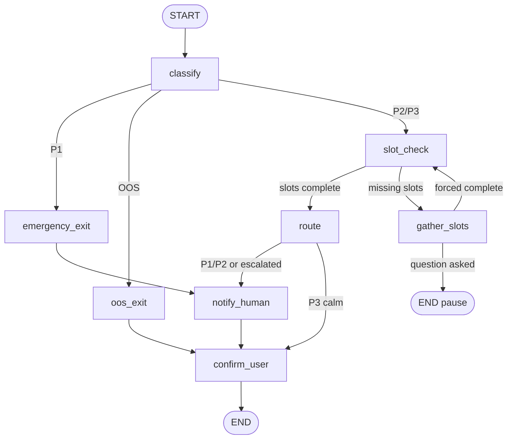

# LangGraph intake triage

Sehat’s intake flow is a **compiled LangGraph `StateGraph`**, not a single LLM chat loop. Each step is a small Python function (a *node*) that reads shared state, returns a partial update, and hands off to the next node via fixed or conditional edges.

Phase 4 implements the graph in:

| File | Role |
|------|------|
| `backend/app/agent/state.py` | `TriageState` schema, slot names, P1 keyword list, `fresh_state()` |
| `backend/app/agent/nodes.py` | Node implementations |
| `backend/app/agent/graph.py` | Graph wiring + `graph = build_graph().compile()` |
| `backend/app/agent/triage.py` | Phase 3 Gemini call used inside `classify_node` |

Run the scratch script (no WhatsApp, no Redis):

```bash
make graph-scratch
# or: cd backend && python scripts/scratch_langgraph_triage.py
```

---

## Mental model



**One `graph.invoke(state)`** runs from `START` until `END` (or until the gather-slots pause). Phase 5 will call invoke from the WhatsApp webhook; Phase 6 will load/save the same `TriageState` in Redis between messages.

---

## State: `TriageState`

State is a `typing_extensions.TypedDict` (required on Python 3.11 with Pydantic/LangGraph).

| Field | Purpose |
|-------|---------|
| `messages` | Conversation turns; uses `Annotated[list[str], operator.add]` so new messages append |
| `patient_phone` | Patient id (WhatsApp sender) |
| `priority` | `P1` \| `P2` \| `P3` \| `OOS` after classify |
| `confidence` | Classifier confidence 0–1 |
| `reasoning` | One-line classifier explanation |
| `clarification_rounds` | Slot-gather attempts (max 2, then escalate) |
| `slots` | Dict of filled intake fields |
| `slots_complete` | Whether required slots are present |
| `routed_to` | Department after `route_node` |
| `escalated` | Human attention needed |
| `slack_notified` | Set when `notify_human_node` runs |
| `reply` | Text to send back to the patient |

Required slots (Phase 4 defaults): `chief_complaint`, `symptom_duration`, `preferred_day`.

`fresh_state(phone)` returns a blank dict for new sessions (Redis memory in Phase 6).

---

## Nodes (in execution order)

### `classify`

- Input: latest string in `messages`.
- **P1 keyword override** runs before Gemini (see `P1_KEYWORDS` in `state.py`). If matched → `P1`, confidence `1.0`, no API call.
- Otherwise calls `classify_message_with_gemini()` (Phase 3).
- If confidence &lt; 0.75 and priority is P2/P3 → sets `escalated=True`.

### `emergency_exit` (P1 only)

- Sets `escalated=True`, `slots_complete=True`, emergency reply (1122 + staff alerted).

### `oos_exit` (OOS only)

- Redirect copy for billing / visa / pharmacy; marks slots complete.

### `slot_check` / `gather_slots` (P2/P3)

- `slot_check` sets `slots_complete` from `missing_slots()`.
- If incomplete → `gather_slots` asks **one** question, increments `clarification_rounds`, then **graph ends** (patient must reply). This avoids an infinite loop inside a single invoke.
- After 2 rounds without completion → escalate and mark slots complete.

### `route`

- Keyword heuristics → `cardiology`, `pediatrics`, or `general` (Phase 8 replaces this with specialist modules).

### `notify_human`

- Phase 4: structured log line (`TRIAGE_ALERT`). Phase 5: Slack webhook in `services/slack.py`.

### `confirm_user`

- Fills a default `reply` if no earlier node set one.

---

## Conditional edges

Routing functions live in `graph.py`:

| After node | Router decides |
|------------|----------------|
| `classify` | `P1` → emergency; `OOS` → oos; else → slot_check |
| `slot_check` | complete → route; else → gather_slots |
| `gather_slots` | complete → slot_check; else → **END** (wait for patient) |
| `route` | escalated or P1/P2 → notify_human; else → confirm_user |

Fixed edges: `emergency_exit` → `notify_human` → `confirm_user` → END; `oos_exit` → `confirm_user` → END.

---

## How LangGraph merges updates

- Nodes return a **`dict` of keys to update**, not the full state.
- Keys without reducers **replace** the previous value.
- `messages` uses **`operator.add`** so `{"messages": ["new"]}` appends instead of overwriting.

Compile once at import:

```python
from app.agent.graph import graph

result = graph.invoke({...})
```

---

## Testing

| Command | What it checks |
|---------|----------------|
| `make test-unit` | `tests/unit/test_graph.py` — P1 keyword path, OOS, P3 with/without slots (Gemini mocked) |
| `make graph-scratch` | Live path for `"seene mein dard"` (needs `GEMINI_API_KEY` only if keywords removed; keywords skip API) |

---

## What comes next (not in Phase 4)

| Phase | Change |
|-------|--------|
| 5 | WhatsApp webhook calls `graph.invoke`; Slack in `notify_human` |
| 6 | Redis `load`/`save` per phone; resume after gather-slots END |
| 7 | `interrupt` at low confidence → `await_human_review`; `update_state` + resume |
| 8 | Specialist prompts in `gather_slots` via `specialists/` |

See also: [architecture overview](./architecture.md), [build order](../plan.md#phase-4--build-the-state-machine-day-3).
