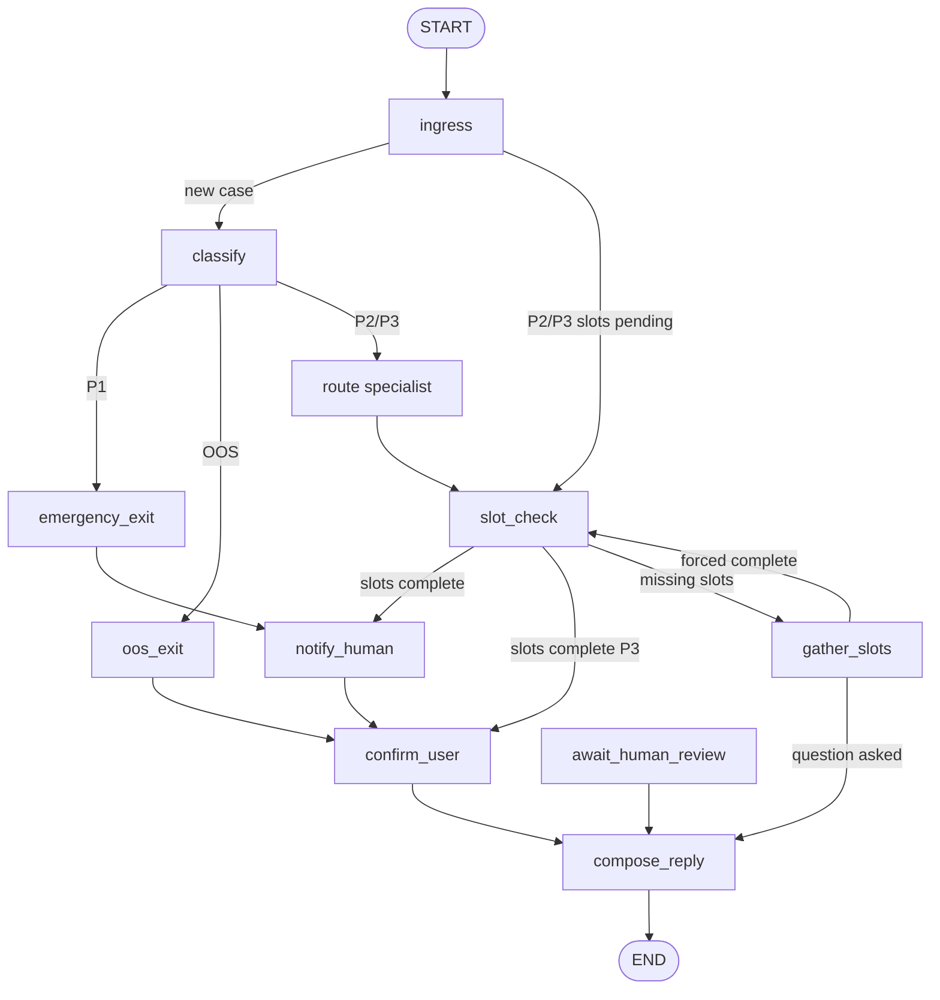

# LangGraph intake triage

Sehat’s intake flow is a **compiled LangGraph `StateGraph`**, not a single LLM chat loop. Each step is a small Python function (a *node*) that reads shared state, returns a partial update, and hands off to the next node via fixed or conditional edges.

Phase 4–5 implement the graph and WhatsApp wiring in:

| File | Role |
|------|------|
| `backend/app/agent/state.py` | `TriageState` schema, slot names, P1 keyword list, `fresh_state()` |
| `backend/app/agent/nodes.py` | Node implementations |
| `backend/app/agent/graph.py` | Graph wiring + `graph = build_graph().compile()` |
| `backend/app/agent/triage.py` | Phase 3 Gemini call used inside `classify_node` |

**Production path (Phase 5):** Green API webhook → `services/intake.process_incoming_message()` → `graph.invoke` → `whatsapp.send_text(reply)`.

Run the scratch script (no WhatsApp):

```bash
make graph-scratch
# or: cd backend && python scripts/scratch_langgraph_triage.py
```

---

## Mental model



**One `graph.invoke(state)`** runs from `START` until `END` (or until the gather-slots pause). The final `compose_reply` node rewrites the structured `reply_intent` into a natural, context-aware patient message using the LLM.

---

## State: `TriageState`

State is a `typing_extensions.TypedDict` (required on Python 3.11 with Pydantic/LangGraph).

| Field | Purpose |
|-------|---------|
| `messages` | Conversation turns; uses `Annotated[list[str], operator.add]` so new messages append |
| `patient_phone` | Patient id (WhatsApp sender) |
| `priority` | `P1` \| `P2` \| `P3` \| `OOS` after classify |
| `confidence` | Classifier confidence 0–1 |
| `reasoning` | One-line classifier explanation |
| `clarification_rounds` | Slot-gather attempts (max 2, then escalate) |
| `slots` | Dict of filled intake fields |
| `slots_complete` | Whether required slots are present |
| `routed_to` | Department after `route_node` |
| `escalated` | Human attention needed |
| `slack_notified` | Set when `notify_human_node` runs |
| `pending_slot` | Slot name the bot is waiting for (filled on next inbound message) |
| `reply_intent` | Structured clinical instruction written by domain nodes, consumed by `compose_reply_node` |
| `reply` | Final natural-language WhatsApp message, written only by `compose_reply_node` |

Required slots depend on `routed_to` (Phase 8): **general** (`chief_complaint`, …), **cardiology** (`pain_location`, …), **pediatrics** (`child_age`, …). See [phase-8 doc](../phase-8-specialist-sub-agents.md).

`fresh_state(phone)` returns a blank dict for new sessions (Redis memory in Phase 6).

---

## Nodes (in execution order)

### `classify`

- Input: latest string in `messages`.
- **P1 keyword override** runs before Gemini (see `P1_KEYWORDS` in `state.py`). If matched → `P1`, confidence `1.0`, no API call.
- Otherwise calls `classify_message_with_gemini()` (Phase 3).
- If confidence &lt; 0.75 and priority is P2/P3 → sets `escalated=True`.

### `emergency_exit` (P1 only)

- Sets `escalated=True`, `slots_complete=True`, emergency reply (1122 + staff alerted).

### `oos_exit` (OOS only)

- Redirect copy for billing / visa / pharmacy; marks slots complete.

### `slot_check` / `gather_slots` (P2/P3)

- `slot_check` sets `slots_complete` from `missing_slots()`.
- If incomplete → `gather_slots` asks **one** question, increments `clarification_rounds`, then **graph ends** (patient must reply). This avoids an infinite loop inside a single invoke.
- After 2 rounds without completion → escalate and mark slots complete.

### `route` (Phase 8)

- Runs **before** slot-filling for P2/P3.
- `specialists/router.py` picks `cardiology`, `pediatrics`, or `general` from priority + keywords.
- Sets `routed_to`; idempotent on resume (ingress skips re-route).

### `notify_human`

- Posts to `SLACK_WEBHOOK_URL` via `services/slack.py` (logs a warning if unset).

### `confirm_user`

- Sets `reply_intent` for the happy-path P2/P3 confirmation if no earlier node set one.

### `compose_reply` *(all paths converge here)*

- Reads `reply_intent` (structured clinical instruction) + full `messages` history.
- Calls `composer.compose_reply()` → OpenAI generates a natural, culturally-aware WhatsApp message.
- Writes the final `reply` field.
- **Natural language rules enforced by the LLM prompt:**
  - Greetings (Assalamualaikum) are answered before any clinical content.
  - Language matches the patient (English / Urdu / Roman Urdu).
  - Off-topic conversations are gently redirected to health concerns.
  - Internal codes (P1/P2/P3/OOS) are never exposed.
  - Falls back to the raw `reply_intent` text if the LLM call fails.

---

## Conditional edges

Routing functions live in `graph.py`:

| After node | Router decides |
|------------|----------------|
| `classify` | `P1` → emergency; `OOS` → oos; else → **route** |
| `route` | always → slot_check |
| `slot_check` | complete + (escalated or P1/P2) → notify_human; complete + P3 → confirm_user; else → gather_slots |
| `gather_slots` | complete + no intent → slot_check; complete + intent (forced) → notify/confirm; else → **compose_reply** → END |

Fixed edges: `emergency_exit` → `notify_human` → `confirm_user` → `compose_reply` → END; `oos_exit` → `confirm_user` → `compose_reply` → END; `await_human_review` → `compose_reply` → END; `gather_slots` (slot question path) → `compose_reply` → END.

---

## How LangGraph merges updates

- Nodes return a **`dict` of keys to update**, not the full state.
- Keys without reducers **replace** the previous value.
- `messages` uses **`operator.add`** so `{"messages": ["new"]}` appends instead of overwriting.

Compile once at import:

```python
from app.agent.graph import graph

result = graph.invoke({...})
```

---

## Testing

| Command | What it checks |
|---------|----------------|
| `make test-unit` | Graph, intake, memory, slack, whatsapp send |
| `pytest tests/integration/test_whatsapp_triage.py` | Webhook → graph → mocked reply |
| `make graph-scratch` | Direct `graph.invoke` without WhatsApp |

---

## What comes next

| Phase | Change |
|-------|--------|
| 6 | Done — Redis-backed `memory.load`/`save` with TTL ([phase-6 doc](../phase-6-session-memory.md)) |
| 7 | `interrupt` at low confidence → `await_human_review`; `update_state` + resume |
| 8 | Done — specialist slots + questions via `specialists/` ([phase-8 doc](../phase-8-specialist-sub-agents.md)) |
| 9 | Done — `make eval` classification report ([phase-9 doc](../phase-9-eval-suite.md)) |

See also: [architecture overview](./architecture.md), [build order](../plan.md#phase-4--build-the-state-machine-day-3).
