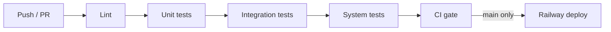

# CI/CD (GitHub Actions)

## Workflows

| Workflow | Trigger | Purpose |
|----------|---------|---------|
| [`.github/workflows/ci.yml`](../.github/workflows/ci.yml) | Push/PR to `main` or `develop` | Lint → unit → integration → system tests |
| [`.github/workflows/deploy.yml`](../.github/workflows/deploy.yml) | CI success on `main`, or manual | Deploy `backend/` to Railway |



## Local commands

From the repo root (mirrors CI):

```bash
make install-dev
make lint
make test
```

Or run layers individually:

```bash
make test-unit
make test-integration
make test-system
```

## Test layers

| Marker | Directory | What it covers |
|--------|-------------|----------------|
| `unit` | `backend/tests/unit/` | Pure helpers (e.g. Green API message parsing) |
| `integration` | `backend/tests/integration/` | HTTP API via in-process `TestClient` |
| `system` | `backend/tests/system/` | Full smoke flows (health + webhooks end-to-end) |

When PostgreSQL/Redis are added, extend **integration** tests with GitHub Actions `services:` containers and keep **system** tests for multi-step user journeys.

## Railway deployment setup

1. Create a [Railway](https://railway.com) project linked to this repo (root directory: `backend`, or use the included `Dockerfile`).
2. In GitHub → **Settings → Secrets and variables → Actions**, add:
   - `RAILWAY_TOKEN` — Railway account or project token ([docs](https://docs.railway.com/guides/github-actions)).
3. Link the Railway project directory to `backend` (Dashboard → Service → Settings → Root Directory).
4. Set production env vars in Railway (same keys as `.env.example`).
5. Optional: create a GitHub **environment** named `production` with required reviewers before deploy.

Manual deploy without waiting for CI:

**Actions → Deploy → Run workflow**

## Branch protection (recommended)

On `main`:

- Require status check **CI gate** (and/or all four jobs).
- Require PR reviews before merge.

Deploy only runs when CI completes successfully on `main`.
