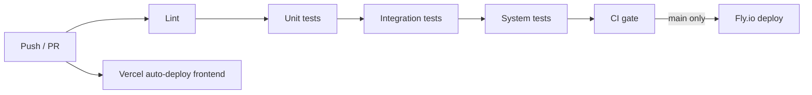

# CI/CD (GitHub Actions)

## Workflows

| Workflow | Trigger | Purpose |
|----------|---------|---------|
| [`.github/workflows/ci.yml`](../.github/workflows/ci.yml) | Push/PR to `main` or `develop` | Lint → unit → integration → system tests |
| [`.github/workflows/deploy.yml`](../.github/workflows/deploy.yml) | CI success on `main`, or manual | Deploy `backend/` to Fly.io |



## Local commands

From the repo root (mirrors CI):

```bash
make install-dev
make lint
make test
```

Or run layers individually:

```bash
make test-unit
make test-integration
make test-phases
make test-system
```

## Test layers

| Marker | Directory | What it covers |
|--------|-------------|----------------|
| `unit` | `backend/tests/unit/`, `backend/tests/phases/` (unit-marked) | Pure helpers (e.g. Green API message parsing) |
| `integration` | `backend/tests/integration/`, `backend/tests/phases/` (integration-marked) | HTTP API via in-process `TestClient` |
| `system` | `backend/tests/system/` | Full smoke flows (health + webhooks end-to-end) |
| `phase1` … `phase9` | `backend/tests/phases/test_phaseNN_*.py` | One suite per [build phase](./plan.md) (1–9); run all with `make test-phases` |

Phase suites mirror the plan’s acceptance criteria (webhook pipe → persistence → OpenAI classify → graph → WhatsApp → memory → dashboard override → specialists → eval fixtures). CI runs phase tests inside the unit and integration jobs with **empty `OPENAI_API_KEY`** and mocks — no billed API calls. Live accuracy checks stay manual: `make eval` (uses your `.env` key only when you run it locally).

When PostgreSQL/Redis are added, extend **integration** tests with GitHub Actions `services:` containers and keep **system** tests for multi-step user journeys.

## Fly.io deployment setup (backend)

1. Create a [Fly.io](https://fly.io) app for `backend/` (see [`runbooks/flyio-deploy_runbook.md`](runbooks/flyio-deploy_runbook.md)).
2. In GitHub → **Settings → Secrets and variables → Actions**, add:
   - `FLY_API_TOKEN` — deploy token from `fly tokens create deploy`.
3. Set production env vars as Fly secrets (same keys as `.env.example`). Postgres on Neon; Redis on Upstash — not on Fly.
4. Optional: create a GitHub **environment** named `production` with required reviewers before deploy.

## Vercel deployment setup (frontend)

1. Import the repo at [vercel.com](https://vercel.com) with **Root Directory** = `frontend`.
2. Set **`VITE_API_URL`** to your Fly API URL (Production environment).
3. Add `frontend/vercel.json` for SPA routing (see runbook section 7.1).
4. Vercel deploys on push to the connected branch — no GitHub Actions workflow required.

Manual backend deploy without waiting for CI:

**Actions → Deploy → Run workflow**

## Branch protection (recommended)

On `main`:

- Require status check **CI gate** (and/or all four jobs).
- Require PR reviews before merge.

Deploy only runs when CI completes successfully on `main`.
