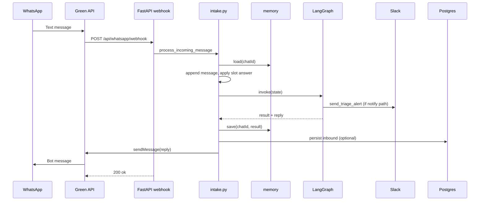

# Phase 5 — WhatsApp + triage graph wiring

**Goal:** A real WhatsApp message hits the webhook, the LangGraph triage graph runs, staff get alerted when needed, and the patient receives a reply on WhatsApp.

**Status:** Implemented.

**Prerequisites:** Phase 4 (LangGraph graph + Gemini classify). See [plan.md](./plan.md) and [architecture/langgraph.md](./architecture/langgraph.md).

---

## What changed

Phase 4 proved the graph in isolation (`graph.invoke` from a scratch script). Phase 5 connects production intake:

```
WhatsApp user
    → Green API POST /api/whatsapp/webhook
    → process_incoming_message()
        → memory.load(chat_id)
        → append message + optional slot answer
        → graph.invoke(state)
        → memory.save(chat_id)
        → persist inbound (Postgres, if DATABASE_URL set)
        → whatsapp.send_text(reply)
    → HTTP 200 {"ok": true}
```

Parallel path inside the graph for urgent cases:

```
classify → emergency_exit → notify_human (Slack) → confirm_user → reply
```

---

## Files added or updated

| File | Role |
|------|------|
| `backend/app/api/whatsapp.py` | Webhook parses Green API JSON; calls `process_incoming_message` for `incomingMessageReceived` |
| `backend/app/services/intake.py` | Orchestration: memory → graph → persist → outbound send |
| `backend/app/services/memory.py` | Per-`chatId` session store (in-process dict; Redis in Phase 6) |
| `backend/app/services/whatsapp.py` | Green API `sendMessage` HTTP client |
| `backend/app/services/slack.py` | Slack incoming-webhook alert for `notify_human_node` |
| `backend/app/agent/nodes.py` | `notify_human` now calls `slack.send_triage_alert` |
| `backend/app/agent/graph.py` | `ingress` node: resume slot-filling without re-classifying follow-ups |
| `backend/app/agent/state.py` | `pending_slot` field for multi-turn slot answers |
| `backend/app/config.py` | `slack_webhook_url` setting |
| `backend/requirements.txt` | `httpx` for outbound HTTP |

---

## Environment variables

Add to repo root `.env` (see `.env.example`):

| Variable | Required for | Notes |
|----------|----------------|-------|
| `GREEN_API_INSTANCE` | WhatsApp **replies** | From Green API console |
| `GREEN_API_TOKEN` | WhatsApp **replies** | Same instance |
| `SLACK_WEBHOOK_URL` | Slack **alerts** | Incoming webhook URL; if empty, alerts are logged only |
| `GEMINI_API_KEY` | P2/P3/OOS classify | P1 often hits keyword override — no API call |
| `DATABASE_URL` | Postgres persist | Optional; webhook still works without it |

---

## Request flow (detail)

### 1. Webhook receives JSON

Only `typeWebhook == "incomingMessageReceived"` with a parseable text body triggers triage. Other events (instance online, ACKs, etc.) still return `200` and `{"ok": true}` so Green API does not retry.

`chatId` from `senderData` (e.g. `79001234567@c.us`) is the session key and the Green API send target.

Supported inbound types in the parser: `textMessage`, `extendedTextMessage`, captions on media, `interactiveButtonsReply`. See `_extract_message_body` in `whatsapp.py`.

### 2. Session memory

```python
state = memory.load(chat_id)   # fresh_state() if new patient
state["messages"].append(body)
```

Sessions are stored via `services/memory.py`. With `REDIS_URL` set, state lives in Redis (24h TTL). Without it, a process-local fallback is used (CI / smoke tests). See [Phase 6 — Session memory](./phase-6-session-memory.md).

### 3. Slot answer before graph

If the previous turn set `pending_slot` (bot asked a question), the new message is stored in `state["slots"][pending_slot]` before invoke:

```python
apply_pending_slot_answer(state)  # in intake.py
```

This avoids re-running `classify` on short answers like `"one week"` or `"Wednesday"`.

### 4. Graph invoke

`graph.invoke(state)` runs the full LangGraph compiled in Phase 4, with one addition:

- **`ingress`** — if `priority` is P2/P3 and slots are incomplete, routing goes to `slot_check` instead of `classify`.

After `gather_slots`, the graph **ends** until the next message when slots are still missing (patient must reply).

### 5. Save and side effects

- `memory.save(chat_id, result)` — updated priority, slots, `reply`, flags.
- `persist_incoming_message(...)` — when `DATABASE_URL` is configured.
- `whatsapp.send_text(chat_id, result["reply"])` — when `reply` is non-empty and Green API credentials exist.

### 6. Slack alert

`notify_human_node` runs on paths that need staff attention (P1 emergency, P2 after route, escalated cases). It POSTs a formatted message to `SLACK_WEBHOOK_URL` with priority, phone, routing, reasoning, and message preview. Timeout is 4 seconds.

---

## Demo scenarios (from plan)

Test from a **second phone** with `make dev` + ngrok (see [Green API runbook](./runbooks/Green-api-whatsapp-integration_runbook.md)).

| Patient message | Expected behaviour |
|-----------------|-------------------|
| `seene mein dard` | P1 keyword override → emergency copy (1122) → Slack alert → WhatsApp reply |
| `appointment chahiye back pain` | Classify P3 → ask slot questions **one per message** → route when slots full |
| `fee kitni hai` | Classify OOS → redirect to Dr Muhid Clinics → **no** slot-filling, no Slack |

### Multi-turn slot example

1. **User:** `appointment chahiye back pain`  
   **Bot:** asks for `chief_complaint` (first missing slot). State has `pending_slot: "chief_complaint"`.

2. **User:** `lower back pain, about a week`  
   **System:** fills `chief_complaint`, clears `pending_slot`, resumes at `slot_check`, may ask `symptom_duration` next.

3. Further messages until all required slots are set → `route` → confirmation reply.

Required slots (Phase 4/5): `chief_complaint`, `symptom_duration`, `preferred_day`.

---

## Behaviour when services are missing

| Missing config | Behaviour |
|----------------|-----------|
| No `GREEN_API_*` | Reply text is **not** sent; warning logged with message preview |
| No `SLACK_WEBHOOK_URL` | Alert **not** sent; warning logged; `slack_notified: false` |
| No `DATABASE_URL` | No DB write; triage + reply still run |
| No `GEMINI_API_KEY` | Classify fails for non-keyword messages (RuntimeError) |

---

## Testing

Automated tests mock HTTP and Gemini — no live WhatsApp or Slack in CI.

| Test file | Marker | What it covers |
|-----------|--------|----------------|
| `tests/unit/test_intake.py` | `unit` | P1 orchestration, OOS, two-message P3 slots |
| `tests/unit/test_memory.py` | `unit` | Load/save isolation |
| `tests/unit/test_slack.py` | `unit` | Webhook POST, errors, missing URL |
| `tests/unit/test_whatsapp_send.py` | `unit` | Green API send URL and payload |
| `tests/integration/test_whatsapp_triage.py` | `integration` | Full `POST /api/whatsapp/webhook` |
| `tests/unit/test_graph.py` | `unit` | Graph paths (updated for Slack mock + `pending_slot`) |

```bash
# From repo root
make test-unit
cd backend && pytest tests/integration/test_whatsapp_triage.py -v
```

Simulate a P1 webhook without WhatsApp:

```bash
curl -X POST http://localhost:8000/api/whatsapp/webhook \
  -H "Content-Type: application/json" \
  -d "{\"typeWebhook\":\"incomingMessageReceived\",\"senderData\":{\"chatId\":\"79001234567@c.us\",\"senderName\":\"Test\"},\"messageData\":{\"typeMessage\":\"textMessage\",\"textMessageData\":{\"textMessage\":\"seene mein dard\"}}}"
```

With Green API configured, the same request also sends the emergency reply to that `chatId`.

---

## Architecture diagram



---

## Session memory (Phase 6)

Phase 6 added Redis-backed `await memory.load` / `save`. The webhook flow is unchanged; see [phase-6-session-memory.md](./phase-6-session-memory.md).

---

## Related documentation

- [Build order — Phase 5](./plan.md#phase-5--wire-the-graph-to-whatsapp-day-34)
- [LangGraph internals](./architecture/langgraph.md)
- [System overview](./architecture/architecture.md)
- [Green API setup](./runbooks/Green-api-whatsapp-integration_runbook.md)
