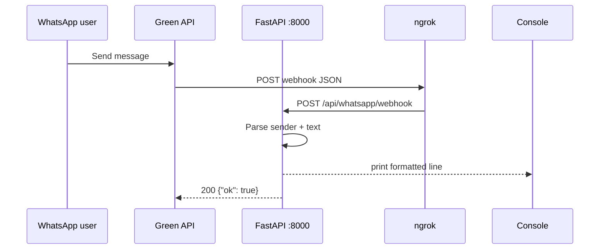

# Green API — WhatsApp integration runbook

**Goal (phase 1):** When someone sends a WhatsApp message to your linked number, you see it in the terminal where FastAPI runs.

```
WhatsApp  →  Green API  →  POST /api/whatsapp/webhook  →  print to console
```

**Code:** `backend/app/main.py` (app) · `backend/app/api/whatsapp.py` (webhook handler)

**Time:** ~20 minutes (account + QR + ngrok + first message)

---

## Prerequisites

| Item | Notes |
|------|--------|
| Python 3.11+ | `python --version` |
| WhatsApp on your phone | Personal number is fine — no Meta Business verification |
| [Green API](https://green-api.com) account | Free tier is enough for development |
| Public HTTPS URL (local dev) | [ngrok](https://ngrok.com) or similar — Green API must reach your machine |

---

## 1. Green API — create instance and link WhatsApp

1. Sign up at [https://green-api.com](https://green-api.com) and open the **console**.
2. Create a **WhatsApp** instance (not WABA unless you intentionally use Business API).
3. Open the instance → **Authorization** → scan the **QR code** with WhatsApp (Linked devices).
4. Wait until instance status is **authorized** / **online**.
5. Copy from the instance page:
   - **idInstance** → `GREEN_API_INSTANCE` in `.env`
   - **apiTokenInstance** → `GREEN_API_TOKEN` in `.env`

Keep the token secret. You do not need the REST send API for this smoke test — only the webhook.

---

## 2. Sehat backend — install and run

From the repo root:

```bash
cp .env.example .env
```

Edit `.env` and set:

```env
GREEN_API_INSTANCE=1234567890
GREEN_API_TOKEN=your_api_token_here
```

Install and start the API:

```bash
cd backend
pip install -r requirements.txt
cd ..
make dev
```

You should see Uvicorn on **http://0.0.0.0:8000**.

> **Windows:** Use `make dev` (not `make dev-reload`). With `--reload`, Uvicorn runs the app in a child process and **incoming webhook prints often never appear** in your terminal even though Green API and ngrok show `200 OK`. Use `make dev-reload` only if you accept that limitation, or develop under WSL/Linux.

Quick check:

```bash
curl http://localhost:8000/health
# {"status":"ok"}
```

---

## 3. Expose localhost to the internet (ngrok)

Green API uses **Webhook Endpoint** technology: their servers **POST** JSON to your URL. `localhost` is not reachable from the internet, so use a tunnel.

1. Install ngrok and sign in: [https://ngrok.com/download](https://ngrok.com/download)
2. In a **second terminal**:

```bash
ngrok http 8000
```

3. Copy the **HTTPS** forwarding URL, e.g. `https://a1b2c3d4.ngrok-free.app`

Your webhook URL will be:

```text
https://<your-ngrok-host>/api/whatsapp/webhook
```

Example:

```text
https://a1b2c3d4.ngrok-free.app/api/whatsapp/webhook
```

> **Note:** Free ngrok URLs change when you restart ngrok. Update Green API `webhookUrl` each time.

---

## 4. Configure Green API webhook

In the Green API **console** → your instance → **API settings** / **Incoming webhooks**:

| Setting | Value |
|---------|--------|
| **Webhook URL** (`webhookUrl`) | `https://<your-ngrok-host>/api/whatsapp/webhook` |
| **Incoming message webhook** (`incomingWebhook`) | **Yes** / enabled |
| **Receive notifications about incoming messages and files** | **On** (console toggle) |

Optional (only if your server checks auth later):

| Setting | Value |
|---------|--------|
| **Webhook URL Token** | Any secret; Green API sends `Authorization: Bearer <token>` |

For phase 1, leave the token empty unless you add verification in code.

### Alternative: debug without ngrok

Use [Webhook.site](https://webhook.site) to confirm Green API is sending events:

1. Paste the unique Webhook.site URL into Green API `webhookUrl`.
2. Send a WhatsApp message — you should see JSON on Webhook.site.
3. Switch `webhookUrl` to your ngrok + `/api/whatsapp/webhook` when ready to test Sehat.

Official docs:

- [Webhook Endpoint technology](https://green-api.com/en/docs/api/receiving/technology-webhook-endpoint/)
- [Incoming text message format](https://green-api.com/en/docs/api/receiving/notifications-format/incoming-message/TextMessage/)

Green API may send webhooks from these IPs (optional firewall allowlist):

```text
46.101.109.139
51.250.12.167
51.250.84.44
51.250.95.149
89.169.137.216
158.160.49.84
165.22.93.202
167.172.162.71
104.248.252.93
158.160.139.176
64.226.111.11
207.154.255.195
```

---

## 5. End-to-end test

1. **Terminal A:** `make dev` (Uvicorn running).
2. **Terminal B:** `ngrok http 8000` (HTTPS tunnel active).
3. Green API `webhookUrl` matches ngrok URL + `/api/whatsapp/webhook`.
4. Instance is **authorized** and **incomingWebhook** is on.
5. From **another phone** (not the linked device), send a WhatsApp text to the number tied to the instance — e.g. `Hello Sehat` or `seene mein dard`.

**Expected in Terminal A (Uvicorn):**

```text
--- WhatsApp (Green API) ---
  webhook : incomingMessageReceived
  from    : John (79001234567@c.us)
  message : Hello Sehat
----------------------------
```

Other webhook types (instance online/offline, outgoing ACK, etc.) still return `200` but print the full JSON payload for debugging.

---

## 6. Manual webhook test (no WhatsApp)

Simulate Green API from your machine:

```bash
curl -X POST http://localhost:8000/api/whatsapp/webhook \
  -H "Content-Type: application/json" \
  -d "{\"typeWebhook\":\"incomingMessageReceived\",\"instanceData\":{\"idInstance\":1,\"wid\":\"0@c.us\",\"typeInstance\":\"whatsapp\"},\"timestamp\":1700000000,\"idMessage\":\"TEST\",\"senderData\":{\"chatId\":\"79001234567@c.us\",\"sender\":\"79001234567@c.us\",\"chatName\":\"Test\",\"senderName\":\"Test\"},\"messageData\":{\"typeMessage\":\"textMessage\",\"textMessageData\":{\"textMessage\":\"seene mein dard\"}}}"
```

You should see the same formatted block with `message : seene mein dard`.

---

## 7. Troubleshooting

| Symptom | What to check |
|---------|----------------|
| No console output | See **“Messages in Green API but not in terminal”** below |
| `winerror 10048` / port in use | Old uvicorn still running — run `make kill-port` then `make dev` again |
| No console output | Uvicorn running? ngrok points to **8000**? `webhookUrl` ends with `/api/whatsapp/webhook`? |

### Messages in Green API but not in terminal

This usually means **ngrok is hitting a different Python process** than the one in your Cursor terminal.

On Windows, failed `make dev` attempts can leave a **zombie uvicorn** bound to `127.0.0.1:8000`. ngrok forwards to `localhost:8000` → that ghost process returns `200 OK` → your visible terminal never sees the request.

**Fix (do in order):**

1. Stop the terminal where `make dev` is running (`Ctrl+C`).
2. From repo root:

```bash
make kill-port
make dev
```

3. Confirm startup lines include your PID:

```text
Sehat ready — WhatsApp webhooks: POST /api/whatsapp/webhook
Process PID 30360 (only one 'make dev' should own port 8000)
```

4. Ensure **ngrok is still running** (`ngrok http 8000`) and Green API `webhookUrl` matches the current ngrok HTTPS URL.
5. Send another WhatsApp message — you should see `INFO:` lines like:

```text
INFO:     --- WhatsApp (Green API) ---
INFO:       webhook : incomingMessageReceived
INFO:       from    : ...
INFO:       message : Hello
```

6. Optional: open [http://127.0.0.1:4040](http://127.0.0.1:4040) — if you see Green API `POST` with `200` but terminal 1 is silent, you still have a port conflict; run `make kill-port` again.

**Check what owns port 8000 (PowerShell):**

```powershell
netstat -ano | findstr ":8000"
```

There should be **only one** `LISTENING` line while developing.
| Green API shows webhook errors | Handler must return **HTTP 200** with body `{"ok": true}` — already implemented. |
| Only status webhooks, no messages | Enable **incomingWebhook** and “incoming messages and files” in console. |
| ngrok “Visit Site” interstitial | Use ngrok paid/static domain, or confirm requests still reach your app (check Uvicorn access log). |
| Message shows `[imageMessage]` etc. | Media without caption — expected for phase 1; caption text is printed when present. |
| Instance unauthorized | Re-scan QR in Green API console. |
| Delayed delivery | Green API retries every ~1 minute if your server was down; delivery guaranteed up to 24h. |

Check Uvicorn access log for:

```text
POST /api/whatsapp/webhook 200
```

If you see `404`, the path is wrong. If you see `422`, the JSON body is malformed.

---

## 8. What happens in code



| File | Role |
|------|------|
| `backend/app/main.py` | Creates FastAPI app, mounts `/api/whatsapp` router |
| `backend/app/api/whatsapp.py` | `POST /webhook` — parses `incomingMessageReceived`, prints, returns 200 |

---

## 9. Next steps (not in phase 1)

- Wire webhook → LangGraph triage (`backend/app/agent/`)
- Reply via Green API `SendMessage` (`backend/app/services/whatsapp.py`)
- Persist messages in Postgres (`backend/app/models/message.py`)
- Deploy with a stable URL (Railway, etc.) — replace ngrok in `webhookUrl`

---

## Quick reference

| | |
|--|--|
| Local API | `http://localhost:8000` |
| Health | `GET /health` |
| Webhook | `POST /api/whatsapp/webhook` |
| Run server | `make dev` from repo root |
| Env vars | `GREEN_API_INSTANCE`, `GREEN_API_TOKEN` |
